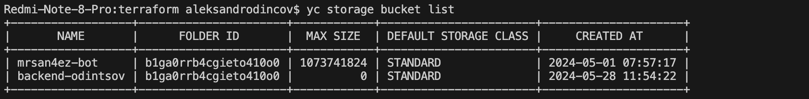
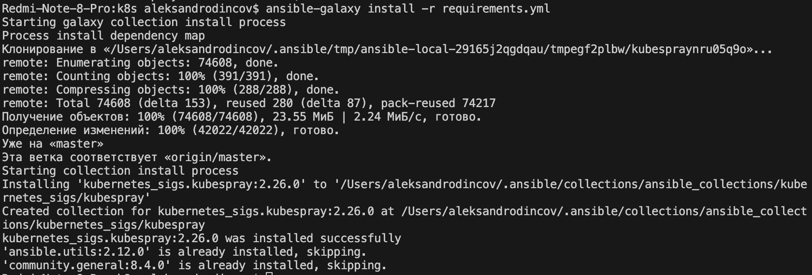

# Этапы выполнения:


### Создание облачной инфраструктуры

Для начала необходимо подготовить облачную инфраструктуру в ЯО при помощи [Terraform](https://www.terraform.io/).

Особенности выполнения:

- Бюджет купона ограничен, что следует иметь в виду при проектировании инфраструктуры и использовании ресурсов;
Для облачного k8s используйте региональный мастер(неотказоустойчивый). Для self-hosted k8s минимизируйте ресурсы ВМ и долю ЦПУ. В обоих вариантах используйте прерываемые ВМ для worker nodes.
- Следует использовать версию [Terraform](https://www.terraform.io/) не старше 1.5.x .

Предварительная подготовка к установке и запуску Kubernetes кластера.

1. Создайте сервисный аккаунт, который будет в дальнейшем использоваться Terraform для работы с инфраструктурой с необходимыми и достаточными правами. Не стоит использовать права суперпользователя

```
# Создаем сервисный аккаунт 
resource "yandex_iam_service_account" "srvac" {
  name = "srvac"
  description = "service account for bucket"
}
# Назначаем роли сервисному аккаунту для управления ресурсами и сетями
resource "yandex_resourcemanager_folder_iam_member" "srvac-editor" {
  folder_id = var.folder_id
  role      = "editor"
  member    = "serviceAccount:${yandex_iam_service_account.srvac.id}"
}
# Назначаем роли сервисному аккаунту  для работы с S3-бакетами
resource "yandex_resourcemanager_folder_iam_member" "srvac-s3" {
  folder_id = var.folder_id
  role      = "storage.admin"
  member    = "serviceAccount:${yandex_iam_service_account.srvac.id}"
}

resource "yandex_kms_symmetric_key" "key-a" {
  name              = "KMS Key"
  description       = "KMS for YC backet"
  default_algorithm = "AES_128"
  rotation_period   = "8760h" // equal to 1 year
  lifecycle {
    prevent_destroy = false
  }
}
```
<p align="center">
  
</p>
2. Подготовьте [backend](https://www.terraform.io/docs/language/settings/backends/index.html) для Terraform:  
   а. Рекомендуемый вариант: S3 bucket в созданном ЯО аккаунте(создание бакета через TF)
   б. Альтернативный вариант:  [Terraform Cloud](https://app.terraform.io/) 

```

# Создаем бакет 
resource "yandex_storage_bucket" "backend-odintsov" {
  access_key    = yandex_iam_service_account_static_access_key.srvac-static-key.access_key
  secret_key    = yandex_iam_service_account_static_access_key.srvac-static-key.secret_key
  bucket        = "backend-odintsov"
  acl           = "public-read"
  force_destroy = "true"
  server_side_encryption_configuration {
    rule {
      apply_server_side_encryption_by_default {
        kms_master_key_id = yandex_kms_symmetric_key.key-a.id
        sse_algorithm     = "aws:kms"
      }
    }
  }
}
```

<p align="center">
  
</p>
3. Создайте VPC с подсетями в разных зонах доступности.

```
# Создание сети 
resource "yandex_vpc_network" "vps" {
  name = var.vpc_name
}
# Создание публичной подсети  в зоне а
resource "yandex_vpc_subnet" "public-a" {
  name           = "public-a"
  zone           = var.zone_a
  network_id     = yandex_vpc_network.vps.id
  v4_cidr_blocks = var.default_cidr_a
}
# Создание публичной подсети  в зоне b
resource "yandex_vpc_subnet" "public-b" {
  name           = "public-b"
  zone           = var.zone_b
  network_id     = yandex_vpc_network.vps.id
  v4_cidr_blocks = var.default_cidr_b
}
# Создание публичной подсети  в зоне d
resource "yandex_vpc_subnet" "public-d" {
  name           = "public-d"
  zone           = var.zone_d
  network_id     = yandex_vpc_network.vps.id
  v4_cidr_blocks = var.default_cidr_d
}

```

<p align="center">
  
</p>

4. Убедитесь, что теперь вы можете выполнить команды `terraform destroy` и `terraform apply` без дополнительных ручных действий.
5. В случае использования [Terraform Cloud](https://app.terraform.io/) в качестве [backend](https://www.terraform.io/docs/language/settings/backends/index.html) убедитесь, что применение изменений успешно проходит, используя web-интерфейс Terraform cloud.

Ожидаемые результаты:

1. Terraform сконфигурирован и создание инфраструктуры посредством Terraform возможно без дополнительных ручных действий.
2. Полученная конфигурация инфраструктуры является предварительной, поэтому в ходе дальнейшего выполнения задания возможны изменения.

---
### Создание Kubernetes кластера

На этом этапе необходимо создать [Kubernetes](https://kubernetes.io/ru/docs/concepts/overview/what-is-kubernetes/) кластер на базе предварительно созданной инфраструктуры.   Требуется обеспечить доступ к ресурсам из Интернета.

Это можно сделать двумя способами:

1. Рекомендуемый вариант: самостоятельная установка Kubernetes кластера.  
   а. При помощи Terraform подготовить как минимум 3 виртуальных машины Compute Cloud для создания Kubernetes-кластера. Тип виртуальной машины следует выбрать самостоятельно с учётом требовании к производительности и стоимости. Если в дальнейшем поймете, что необходимо сменить тип инстанса, используйте Terraform для внесения изменений.  

Создаем 3 ВМ в разныз подсетях 

одину master ноду 
   ```

resource "yandex_compute_instance" "master" {
    name        = "master-${count.index + 1}"
  platform_id = "standard-v1"
  
  count = 1

  resources {
    cores  = 2
    memory = 4
    core_fraction = 20
  }
  boot_disk {
    initialize_params {
      image_id = data.yandex_compute_image.ubuntu-2004-lts.image_id
      size = 20
    }
  }
  scheduling_policy {
    preemptible = false
  }
  network_interface {
    subnet_id = yandex_vpc_subnet.public-d.id
    nat       = true
  }
  
  depends_on = [yandex_compute_instance.worker]
  metadata = {
    user-data          = data.template_file.cloudinit.rendered
    serial-port-enable = 1
  }

}
```
и две worker ноды 

```
resource "yandex_compute_instance" "worker" {
    name        = "worker-${count.index + 1}"
    zone = var.node_zones[count.index]
  platform_id = "standard-v1"
  
  count = 2

  resources {
    cores  = 2
    memory = 2
    core_fraction = 20
  }

  boot_disk {
    initialize_params {
      image_id = data.yandex_compute_image.ubuntu-2004-lts.image_id
      type = "network-hdd"
      size = 20
    }   
  }

    metadata = {
      user-data          = data.template_file.cloudinit.rendered
      serial-port-enable = 1
  }

  scheduling_policy { preemptible = false }

  network_interface {
    subnet_id = lookup(
      {
        "ru-central1-a" = yandex_vpc_subnet.public-a.id,
        "ru-central1-b" = yandex_vpc_subnet.public-b.id,
        "ru-central1-d" = yandex_vpc_subnet.public-d.id,
      },
      var.node_zones[count.index],
      null
    )
    nat       = true
  }
  allow_stopping_for_update = true
  
}
```
<p align="center">
  
</p>

   б. Подготовить [ansible](https://www.ansible.com/) конфигурации, можно воспользоваться, например [Kubespray](https://kubernetes.io/docs/setup/production-environment/tools/kubespray/)  
   в. Задеплоить Kubernetes на подготовленные ранее инстансы, в случае нехватки каких-либо ресурсов вы всегда можете создать их при помощи Terraform.

с помощью шаблона создаем файл [инвенторки](./terraform/hosts.tftpl) 
развертывать клстер будем с помощью  [Kubespray](https://github.com/kubernetes-sigs/kubespray) , склонировов его 
после этого проверим зависимости ``` ansible-galaxy install -r requirements.yml ``` 
<p align="center">
  
</p>

Устроновим gj для редактирование файла kubconfig 
```
brew install jq
```
Запускаем скрипт по установки кластера 

```
cp k8s
bash k8s_install.sh 
```
скрипт сделает 
 - переименует папку inventory/sample в kubespray
 - скопирует туда ранее сгенерированный файл hosts.yaml
 - настриваит kubespray что бы получить файл конфигурации на локальный хост 
 - запустит kubespray
 - отредактирует файл конфигурации и скопирует его в локальную папку ~/.kube/config


2. Альтернативный вариант: воспользуйтесь сервисом [Yandex Managed Service for Kubernetes](https://cloud.yandex.ru/services/managed-kubernetes)  
  а. С помощью terraform resource для [kubernetes](https://registry.terraform.io/providers/yandex-cloud/yandex/latest/docs/resources/kubernetes_cluster) создать **региональный** мастер kubernetes с размещением нод в разных 3 подсетях      
  б. С помощью terraform resource для [kubernetes node group](https://registry.terraform.io/providers/yandex-cloud/yandex/latest/docs/resources/kubernetes_node_group)
  
Ожидаемый результат:

1. Работоспособный Kubernetes кластер.
2. В файле `~/.kube/config` находятся данные для доступа к кластеру.
<p align="center">
  
</p>
3. Команда `kubectl get pods --all-namespaces` отрабатывает без ошибок.
<p align="center">
  
</p>

---
### Создание тестового приложения

Для перехода к следующему этапу необходимо подготовить тестовое приложение, эмулирующее основное приложение разрабатываемое вашей компанией.

Способ подготовки:

1. Рекомендуемый вариант:  
   а. Создайте отдельный git репозиторий с простым nginx конфигом, который будет отдавать статические данные.  
   б. Подготовьте Dockerfile для создания образа приложения.  
2. Альтернативный вариант:  
   а. Используйте любой другой код, главное, чтобы был самостоятельно создан Dockerfile.

Ожидаемый результат:

1. Git репозиторий с тестовым приложением и Dockerfile.
2. Регистри с собранным docker image. В качестве регистри может быть DockerHub или [Yandex Container Registry](https://cloud.yandex.ru/services/container-registry), созданный также с помощью terraform.

---